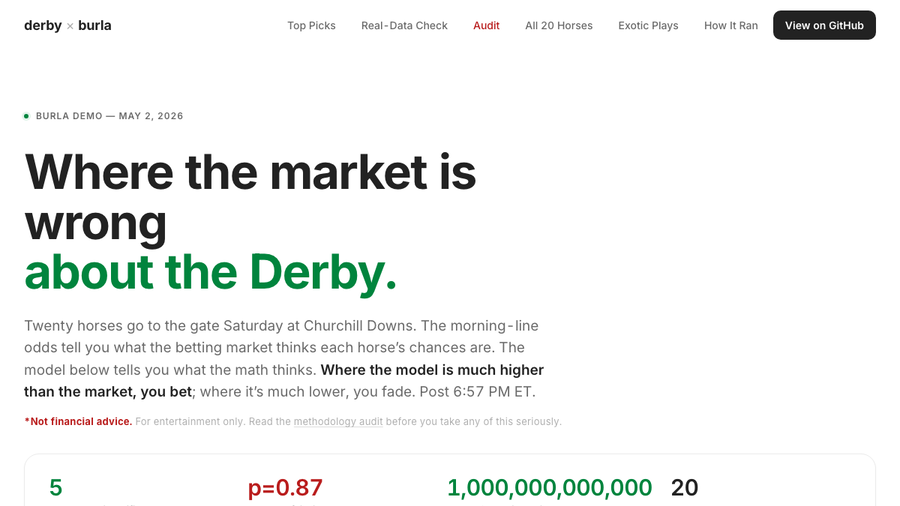

# Burla Examples

Plain Python in. Remote hardware out. These examples scale copyable scripts onto
CPUs, A100 GPUs, custom Docker images, and explicit concurrency limits without
turning the project into a distributed-systems rewrite.

<table>
  <tr>
    <td align="center"><strong>20 example folders</strong><br>from one-file fan-out to full pipelines</td>
    <td align="center"><strong>8 live demos</strong><br>with published findings and artifacts</td>
    <td align="center"><strong>CPU, GPU, Docker</strong><br>changed per function call</td>
    <td align="center"><strong>One Python API</strong><br><code>remote_parallel_map</code></td>
  </tr>
</table>

<p align="center">
  <a href="https://burla-cloud.github.io/examples/">Live gallery</a>
  &middot;
  <a href="https://burla.dev">Burla docs</a>
  &middot;
  <a href="#pick-a-collection">Pick a collection</a>
  &middot;
  <a href="#what-burla-is-showing-off-here">What Burla shows off</a>
</p>

## Pick a collection

| Collection | Start here if you want to see... | Examples |
| --- | --- | --- |
| [Data stories with live sites](#data-stories-with-live-sites) | finished, explorable outputs built from large public datasets | Airbnb, Kentucky Derby, Amazon Reviews, NYC Taxi, arXiv, The Met, World Photo Index, GitHub READMEs |
| [ML, embeddings, and vision](#ml-embeddings-and-vision) | model-heavy jobs where runtime and hardware choice matter | A100 embeddings, batch inference |
| [Production data jobs](#production-data-jobs) | the scripts data teams actually need to make fast and reliable | image resize, Parquet, pandas, ETL, APIs, scraping |
| [Native tools and simulations](#native-tools-and-simulations) | binaries, geospatial dependencies, and massive independent compute | BWA-MEM, GDAL, Monte Carlo |

## Data stories with live sites

These are the showpieces: real corpora, real scale, and static sites you can
open before reading a single line of code.

<table>
  <tr>
    <td width="50%" valign="top">
      <a href="https://burla-cloud.github.io/examples/airbnb-burla-demo/"></a>
      <h3><a href="https://burla-cloud.github.io/examples/airbnb-burla-demo/">Airbnb at continental scale</a></h3>
      <p><strong>119 cities, 1.7M photos, 50.7M reviews.</strong></p>
      <p>CLIP scores images, A100s embed review shortlists, Claude validates visual finds, and bootstrap CIs test whether the weird stuff affects demand.</p>
      <p><a href="https://burla-cloud.github.io/examples/airbnb-burla-demo/">Live demo</a> &middot; <a href="airbnb-burla-demo/">Source</a></p>
    </td>
    <td width="50%" valign="top">
      <a href="https://burla-cloud.github.io/examples/kentucky-derby-demo/"></a>
      <h3><a href="https://burla-cloud.github.io/examples/kentucky-derby-demo/">Kentucky Derby prediction and audit</a></h3>
      <p><strong>1T Monte Carlo sims in 18.3 minutes, then 2,000 audit permutations in 13.8 seconds.</strong></p>
      <p>The same Burla cluster runs the prediction and then stress-tests the model hard enough to publish where the method is fragile.</p>
      <p><a href="https://burla-cloud.github.io/examples/kentucky-derby-demo/">Live demo</a> &middot; <a href="kentucky-derby-prediction/">Prediction source</a> &middot; <a href="kentucky-derby-demo/">Demo source</a></p>
    </td>
  </tr>
  <tr>
    <td width="50%" valign="top">
      <a href="https://burla-cloud.github.io/examples/amazon-review-distiller/"></a>
      <h3><a href="https://burla-cloud.github.io/examples/amazon-review-distiller/">Amazon Review Distiller</a></h3>
      <p><strong>571M reviews, 275GB JSONL, 500+ parallel CPUs.</strong></p>
      <p>Score every public Amazon review deterministically, keep tiny heaps per shard, and reduce them into searchable findings.</p>
      <p><a href="https://burla-cloud.github.io/examples/amazon-review-distiller/">Live demo</a> &middot; <a href="amazon-review-distiller/">Source</a></p>
    </td>
    <td width="50%" valign="top">
      <a href="https://burla-cloud.github.io/examples/nyc-ghost-neighborhoods/"></a>
      <h3><a href="https://burla-cloud.github.io/examples/nyc-ghost-neighborhoods/">NYC Ghost Neighborhoods</a></h3>
      <p><strong>2.76B taxi and FHV trips in about 15 seconds.</strong></p>
      <p>Scan every monthly public trip file to find zones that faded, recovered, or became newly important after the pandemic.</p>
      <p><a href="https://burla-cloud.github.io/examples/nyc-ghost-neighborhoods/">Live demo</a> &middot; <a href="nyc-ghost-neighborhoods/">Source</a></p>
    </td>
  </tr>
  <tr>
    <td width="50%" valign="top">
      <a href="https://burla-cloud.github.io/examples/arxiv-fossils/"></a>
      <h3><a href="https://burla-cloud.github.io/examples/arxiv-fossils/">Fossils of the arXiv</a></h3>
      <p><strong>2.71M abstracts embedded and clustered.</strong></p>
      <p>Embed the full arXiv metadata corpus to find extinct topics, emerging clusters, and isolated papers.</p>
      <p><a href="https://burla-cloud.github.io/examples/arxiv-fossils/">Live demo</a> &middot; <a href="arxiv-fossils/">Source</a></p>
    </td>
    <td width="50%" valign="top">
      <a href="https://burla-cloud.github.io/examples/met-weirdest-art/"></a>
      <h3><a href="https://burla-cloud.github.io/examples/met-weirdest-art/">The Met's Hidden Twins</a></h3>
      <p><strong>192K public-domain artwork images.</strong></p>
      <p>Fetch Open Access museum images, embed them with CLIP, search with FAISS, and surface visual near-duplicates across centuries.</p>
      <p><a href="https://burla-cloud.github.io/examples/met-weirdest-art/">Live demo</a> &middot; <a href="met-weirdest-art/">Source</a></p>
    </td>
  </tr>
  <tr>
    <td width="50%" valign="top">
      <a href="https://burla-cloud.github.io/examples/world-photo-index/"></a>
      <h3><a href="https://burla-cloud.github.io/examples/world-photo-index/">World Photo Index</a></h3>
      <p><strong>9.49M geotagged Flickr photos, 967 workers, about 8 minutes.</strong></p>
      <p>Reverse-geocode public photos and build country-level signatures from user-written tags.</p>
      <p><a href="https://burla-cloud.github.io/examples/world-photo-index/">Live demo</a> &middot; <a href="world-photo-index/">Source</a></p>
    </td>
    <td width="50%" valign="top">
      <a href="https://burla-cloud.github.io/examples/github-repo-summarizer/"></a>
      <h3><a href="https://burla-cloud.github.io/examples/github-repo-summarizer/">One Million GitHub READMEs</a></h3>
      <p><strong>1.2M READMEs, 2.3B upstream file rows.</strong></p>
      <p>Shard deterministic summarizers, write per-shard JSON to shared storage, and reduce category stats without calling an LLM.</p>
      <p><a href="https://burla-cloud.github.io/examples/github-repo-summarizer/">Live demo</a> &middot; <a href="github-repo-summarizer/">Source</a></p>
    </td>
  </tr>
</table>

## ML, embeddings, and vision

These examples are about changing the machine under a Python function: CPUs for
download and preprocessing, GPUs for inference, and custom images when the
runtime actually matters.

<table>
  <tr>
    <td width="50%" valign="top">
      <a href="gpu-embedding-demo/"></a>
      <h3><a href="gpu-embedding-demo/">GPU embeddings on A100s</a></h3>
      <p><strong>50K Wikipedia articles across CPU and A100 stages.</strong></p>
      <p>Download text on CPU workers, embed with a custom CUDA image, write vector shards, and search locally.</p>
    </td>
    <td width="50%" valign="top">
      <a href="ml-inference-batch/"></a>
      <h3><a href="ml-inference-batch/">Batch inference without serving</a></h3>
      <p><strong>10M text rows scored as a batch job.</strong></p>
      <p>Load a Hugging Face model once per worker and score Parquet batches without standing up an endpoint.</p>
    </td>
  </tr>
</table>

## Production data jobs

The practical middle of the repo: common data work that usually becomes slow,
fragile, or over-orchestrated when it leaves one laptop.

<table>
  <tr>
    <td width="33%" valign="top">
      <a href="image-dataset-resize/"></a>
      <h3><a href="image-dataset-resize/">Millions of image resizes</a></h3>
      <p>Chunk S3 image keys, resize with Pillow, write outputs back to S3, and stream progress.</p>
    </td>
    <td width="33%" valign="top">
      <a href="parquet-parallel/"></a>
      <h3><a href="parquet-parallel/">One Parquet file per worker</a></h3>
      <p>Compute QA stats across thousands of files without starting Spark for a file-parallel job.</p>
    </td>
    <td width="33%" valign="top">
      <a href="pandas-apply-parallel/"></a>
      <h3><a href="pandas-apply-parallel/">Pandas apply in parallel</a></h3>
      <p>Keep the row-wise Python function and scale the partitioned dataset around it.</p>
    </td>
  </tr>
  <tr>
    <td width="33%" valign="top">
      <a href="python-etl-no-airflow/"></a>
      <h3><a href="python-etl-no-airflow/">ETL without Airflow</a></h3>
      <p>Transform 10,000 gzipped JSON drops while protecting Postgres with <code>max_parallelism</code>.</p>
    </td>
    <td width="33%" valign="top">
      <a href="rate-limited-api-requests/"></a>
      <h3><a href="rate-limited-api-requests/">Rate-limited API jobs</a></h3>
      <p>Run millions of requests while keeping provider limits explicit in chunking, sleeps, and concurrency.</p>
    </td>
    <td width="33%" valign="top">
      <a href="parallel-web-scraping/"></a>
      <h3><a href="parallel-web-scraping/">Parallel web scraping</a></h3>
      <p>Scrape large static archives with retries, error rows, connection reuse, and a global cap.</p>
    </td>
  </tr>
</table>

## Native tools and simulations

Examples for workloads that do not fit neatly into dataframe systems: native
binaries, geospatial stacks, and embarrassingly parallel simulation.

<table>
  <tr>
    <td width="33%" valign="top">
      <a href="bioinformatics-alignment/"></a>
      <h3><a href="bioinformatics-alignment/">Genome alignment</a></h3>
      <p>Run BWA-MEM and samtools in a custom image with one paired-end FASTQ sample per worker.</p>
    </td>
    <td width="33%" valign="top">
      <a href="gdal-raster-processing/"></a>
      <h3><a href="gdal-raster-processing/">GDAL raster processing</a></h3>
      <p>Compute NDVI, clip, or reproject one Sentinel tile per worker with geospatial dependencies ready.</p>
    </td>
    <td width="33%" valign="top">
      <a href="monte-carlo-simulation/"></a>
      <h3><a href="monte-carlo-simulation/">Billion-path Monte Carlo</a></h3>
      <p>Run independent simulations across thousands of workers and return tiny aggregate summaries.</p>
    </td>
  </tr>
</table>

## What Burla Is Showing Off Here

| Capability | Where it shows up |
| --- | --- |
| Change hardware per call | CPU photo scoring in Airbnb, A100 embedding in Wikipedia/arXiv/The Met, CPU-only simulation in Kentucky Derby |
| Change runtime per function | CUDA image for embeddings, GDAL image for raster jobs, BWA/samtools image for genomics |
| Keep plain Python control flow | scripts call `remote_parallel_map` directly instead of rewriting into Spark, Ray, Airflow, or Kubernetes objects |
| Put concurrency in the code | API limits, Postgres protection, website politeness, and cluster quota control live next to the workload |
| Stream useful artifacts back | generated sites, Parquet shards, vector indexes, JSON outputs, and progress from `generator=True` |

```python
from burla import remote_parallel_map

cpu_results = remote_parallel_map(
    parse_one_file,
    files,
    func_cpu=2,
    func_ram=8,
    max_parallelism=1000,
    generator=True,
)

gpu_vectors = remote_parallel_map(
    embed_one_shard,
    shards,
    func_gpu="A100",
    image="my-cuda-worker:latest",
    max_parallelism=8,
)

api_rows = remote_parallel_map(
    call_one_endpoint,
    request_batches,
    max_parallelism=64,
    generator=True,
)
```

## Links

- Burla docs: <https://burla.dev>
- Live examples gallery: <https://burla-cloud.github.io/examples/>
- Burla GitHub: <https://github.com/Burla-Cloud>
